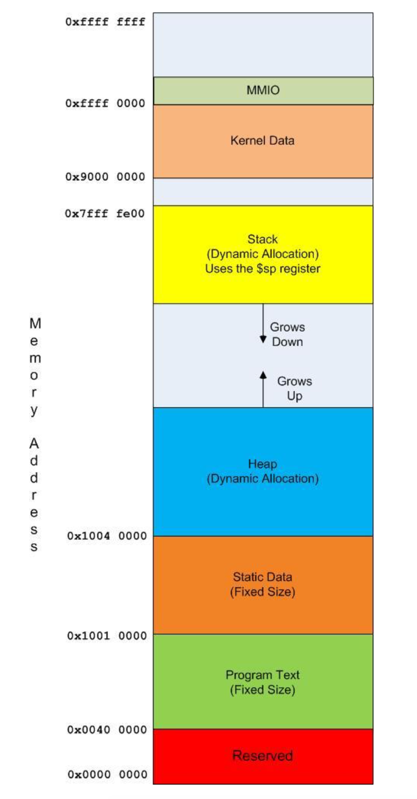

# 1 MIPS汇编中的第一个程序

本章介绍MIPS汇编中的Hello World程序，主要是理解寄存器和I/O机制。

## 1.1 MARS IDE

在这个网站下载即可：http://courses.missouristate.edu/kenvollmar/mars/index.htm，需要安装JAVA环境。

## 1.2 MIPS和内存

汇编语言将多种内存显式区分开来，并强迫编程的人使用它们，包括堆、静态数据、文本、堆栈和寄存器。

### 1.2.1 内存的种类

MIPS中的内存主要分成两大类，第一类是在CPU里的内存，通常称为寄存器；第二类是通常意义下的内存，是用来放置指令和数据的地方。

非寄存器部分的内存可以分成很多类，在这里我们仅研究文本、静态数据、堆和栈。

在这里，我们介绍的内存是一种比较老旧的模型，单线程且无虚拟机。

### 1.2.2 MIPS CPU

MIPS CPU包含32个寄存器，每个寄存器可以存储32bit的值。将CPU的基本目的看作对两个来自寄存器的值进行ALU运算并将结果存储到第三个寄存器是合理的。

需要通过lw和sw操作将地址和数据从内存中传入CPU，CPU才可以使用这部分数据。

除此之外，CPU还可以从外设中读取数据和地址。

### 1.2.3 寄存器

一共有32个寄存器，被分成了11类，每一类都有不同的功能，可以供编程者使用的、常用的寄存器包括：

- \$v0-\$v1：用于保存子程序的返回值，\$v0还用于syscall
- \$a0-\$a3：将参数传递给子程序
- \$t0-\$t9：存储临时变量，调用子程序时，临时变量的值会发生变化
- \$s0-\$s8：存储保存的值，在子程序调用中保持不变
- \$gp：指向全局内存的指针，与堆分配一起使用
- \$sp：堆栈指针
- \$fp：帧指针
- \$ra：返回地址，指向从子程序返回时使用的地址

### 1.2.4 MIPS内存的种类

MIPS的内存是32bit的平坦的内存，这意味着MIPS上的内存是连续的，从地址0x00000000到0xffffffff。

32bit的内存表明程序可以在4GB的数据中进行寻址，但编程者并不能使用所有的内存，有一些内存被操作系统使用，有一些被I/O子系统使用。但整个4GB的内存都是可以寻址的。

MIPS使用的内存类型：



## 1.3 MIPS汇编的第一个程序

第一个程序的代码：

```assembly
# 程序文件：Program2-1.asm
# 作者：Charles Kann
# 用途：第一个程序，Hello World
.text	# 定义程序指令
main:	# 主程序
	li $v0, 4	# 将4加载到$v0中，打印字符串
	la $a0, greeting	# 将greeting的地址加载到$a0中
	syscall	# 打印greeting
	
	li $v0, 10	# 将10（停止）加载到$v0
	syscall	# 程序结束
.data
greeting: .asciiz "Hello World"	# 要打印的字符串
```

### 1.3.1 细节

介绍Program2-1的一些细节。

等一会再介绍。

## 1.4 给出提示并从用户那里读取整数的程序

这个程序是，提示用户输入一个整数，然后将这个整数读入寄存器，并且打印回给用户。

```assembly
# 程序文件：Program2-2.asm
# 作者：Charles Kann
# 用途：提示用户输入一个整数，然后将这个整数读入寄存器，并且打印回给用户。
.text
main:
	# 提示输入整数
	li $v0, 4
	la $a0, prompt
	syscall
	
	# 读取整数并保存在$s0
	li $v0, 5
	syscall
	move $s0, $v0
	
	# 输出文字
	li $v0, 4
	la $a0, output
	syscall
	
	# 输出数字
	li $v0, 1
	move $a0, $s0
	syscall
	
	# 退出程序
	li $v0, 10
	syscall
	
.data
prompt: .asciiz "Please enter an integer: "
output: .asciiz "\n You typed the number: "
```

### 1.4.1 细节

介绍Program2-2的一些细节。

等一会再介绍。

## 1.5 给出提示并从用户那里读取字符串的程序

和上一个程序看起来很相似，但在概念上有很大的差别。

```assembly
# 程序文件：Program2-3.asm
# 作者：Charles Kann
# 用途：提示用户输入一个字符串，然后将这个字符串打印回给用户。
.text
main:
	# 提示输入一个字符串
	li $v0, 4
	la $a0, prompt
	syscall
	
	# 读取字符串
	li $v0, 8
	la $a0, input
	lw $a1, inputSize
	syscall
	
	# 输出文本
	li $v0, 4
	la $a0, output
	syscall
	
	# 输出字符串
	li $v0, 4
	la $a0, input
	syscall
	
	# 退出程序
	li $v0, 10
	syscall

.data
input: .space 81
inputSize: .word 80
prompt: .asciiz "Please enter an string: "
output: .asciiz "\n You typed the string: "
```

### 1.5.1 细节

介绍Program2-3的一些细节。

等一会再介绍。

## 1.6 总结

这一章主要是介绍如何在MARS中创建和运行带有I/O的简单汇编程序，涵盖了以下内容：

- MIPS程序的注释
- MIPS计算机中的寄存器和内存
- 汇编程序指令：`.text`, `.data`, `.asciiz`, `.space`, `.word`
- MIPS汇编程序中的labels
- MIPS汇编操作符：`li`, `la`, `lw`, `move`
- 不同的`syscall`，特别是1, 4, 5, 8
- 引用和数据值之间的差异

# 2 MIPS算术和逻辑运算符

## 2.1 3-地址机

MIPS的大多数操作允许指定三个寄存器作为指令的一部分，所以MIPS CPU的组织架构被称为“3-地址机”。

R型指令：`[operator] Rd, Rs, Rt`，含义是：`Rd <- Rs [operator] Rt`

I型指令：`[operator]i Rt, Rs, 立即数`，含义是：`Rt <- Rs [operator]i 立即数`

立即数和常量之间的区别：常量是在内存中的值，使用前必须加载到寄存器中；立即数作为指令的一部分，可以直接使用。所以处理立即数比处理常量快。

jump操作符是最明显的不符合3-地址格式的预算符，branch和store操作符也不符合，这个在后面详细介绍。

还有一些操作是“伪操作”，例如`move`和`li`，在实际的MIPS指令集中并不存在，在使用时会被转换成需要的实际操作符。

## 2.2 加法

### 2.2.1 加法运算符

- `add`，整数
  - 格式：`add Rd, Rs, Rt`
  - 含义：`Rd <- Rs + Rt`
- `addi`，整数
  - 格式：`addi Rt, Rs, 立即数`
  - 含义：`Rt <- Rs + 立即数`
- `addu`，无符号或整二进制数
  - 格式：`addu Rd, Rs, Rt`
  - 含义：`Rd <- Rs + Rt`

- `addiu`，无符号或整二进制数
  - 格式：`addiu Rt, Rs, 立即数`
  - 含义：`Rt <- Rs + 立即数`

还有加法的伪运算符，

- `add`使用16位立即数，也就是`addi`的简写。
  - 格式：`add Rt, Rs, 立即数`
  - 含义：`Rt <- Rs + 立即数`
  - 翻译：`addi Rt, Rs, 立即数`
- `add*`带32位立即数。在真正的I型指令中，立即数最高只能是16位，超过的话需要分两步加载：先用`lui`加载高16位，再用`ori`加载低16位。
  - 示例：`addi Rt, Rs, (32 bit)立即数`
  - 翻译：
    - `lui $at10, (upper 16 bits) 立即数`
    - `ori $at, $at, (lower 16 bits) 立即数`
    - `add Rt, Rs, $at11`

### 2.2.2 加法示例

```assembly
# 程序文件：Program3-1.asm
# 作者：Charles Kann
# 用途：加法运算符

# R型指令
li $t1, 100
li $t2, 50
add $t0, $t1, $t2

# 立即数
addi $t0, $t0, 50
add $t0, $t0, 50

# 无符号，结果不是负数
addiu $t0, $t2, -100

# 32位立即数
addi $t1, $t2, 5647123
```

### 2.2.3 伪代码

写一些伪代码会让编程者避免陷入复杂的汇编代码中。

示例：

```
main
{
	register int i = input{"Please enter the first value to add: "}
	register int j = input{"Please enter the second value to add: "}
	register int k = i + j
	print("The result is " + k)
}
```

### 2.2.4 翻译成汇编

```assembly
# 程序文件：Program3-2.asm
# 作者：Charles Kann
# 用途：伪代码转换成汇编

# 伪代码
# main
# {
# 	register int i = input{"Please enter the first value to add: "}
# 	register int j = input{"Please enter the second value to add: "}
# 	register int k = i + j
# 	print("The result is " + k)
# }

.text
.global main
main:
	# 寄存器定义
	# i: $s0
	# j: $s1
	# k: $s2
	# register int i = input{"Please enter the first value to add: "}
	addi $v0, $zero, 4
	la $a0, prompt1
	syscall
	addi $v0, $zero, 5
	syscall
	move $s0, $v0
	
	# register int j = input{"Please enter the second value to add: "}
	addi $v0, $zero, 4
	la $a0, prompt2
	syscall
	addi $v0, $zero, 5
	syscall
	move $s1, $v0
	
	# register int k = i + j
	add $s2, $s1, $s0
	
	# print("The result is " + k)
	addi $v0, $zero, 4
	la $a0, result
	syscall
	addi $v0, $zero, 1
	move $a0, $s2
	syscall
	
	# 程序结束
	addi $v0, $zero, 10
	syscall
.data
prompt1: .asciiz "Please enter the first value to add: "
prompt2: .asciiz "Please enter the second value to add: "
result: .asciiz "The result is "
```

## 2.3 减法

`sub`, `subu`, `subui`类似于加法，但`subi`并不是真正的指令，是一个伪指令，先将要减去的值加载到$at寄存器中，然后用R指令进行运算。

- `sub`，整数
  - 格式：`sub Rd, Rs, Rt`
  - 含义：`Rd <- Rs - Rt`
- `sub`伪运算符
  - 格式：`sub Rt, Rs, 立即数`
  - 含义：`Rt <- Rs - 立即数`
  - 翻译：
    - `addi $at, $zero, 立即数`
    - `sub Rt, Rs, $at`
- `subi`，伪运算符
  - 格式：`subi Rt, Rs, 立即数`
  - 含义：`Rt <- Rs - 立即数`
  - 翻译：
    - `addi $at, $zero, 立即数`
    - `sub Rt, Rs, $at`
- `subu`，无符号数
  - 格式：`subu Rd, Rs, Rt`
  - 含义：`Rd <- Rs - Rt`

- `subiu`，伪运算符
  - 格式：`subiu Rt, Rs, 立即数`
  - 含义：`Rt <- Rs - 立即数`
  - 翻译：
    - `addi $at, $zero, 立即数`
    - `subu Rt, Rs, $at`

## 2.4 乘法

先跳一跳

## 2.5 除法

先跳一跳

## 2.6 求解算术表达式

## 2.7 除法与精度

## 2.8 逻辑运算符

MIPS中只实现了位运算符，但被称为逻辑运算符。

- `and`

  - `and`，按位与
    - 格式：`and Rd, Rs, Rt`
    - 含义：`Rd <- Rs AND Rt`
  - `and`，立即数的伪运算符
    - 格式：`and Rt, Rs, 立即数`
    - 含义：`Rt <- Rs AND 立即数`
    - 翻译：`andi Rt, Rs, 立即数`

  - `and`，自身与立即数的伪运算符
    - 格式：`and Rs, 立即数`
    - 含义：`Rs <- Rs AND 立即数`
    - 翻译：`andi Rs, Rs, 立即数`

- `andi`
  - `andi`，立即数按位与
    - 格式：`andi Rt, Rs, 立即数`
    - 含义：`Rt <- Rs AND 立即数`
  - `andi`，自身与立即数
    - 格式：`andi Rs, 立即数`
    - 含义：`Rs <- Rs AND 立即数`
    - 翻译：`andi Rs, Rs, 立即数`
- `or`
  - `or`，按位或
    - 格式：`or Rd, Rs, Rt`
    - 含义：`Rd <- Rs OR Rt`
  - `or`，立即数的伪运算符
    - 格式：`or Rt, Rs, 立即数`
    - 含义：`Rt <- Rs OR 立即数`
    - 翻译：`ori Rt, Rs, 立即数`
  - `or`，自身与立即数的伪运算符
    - 格式：`or Rs, 立即数`
    - 含义：`Rs <- Rs OR 立即数`
    - 翻译：`ori Rs, Rs, 立即数`
- `ori`
  - `ori`，立即数按位或
    - 格式：`ori Rt, Rs, 立即数`
    - 含义：`Rt <- Rs OR 立即数`
  - `ori`，自身与立即数的伪运算符
    - 格式：`ori Rs, 立即数`
    - 含义：`Rs <- Rs OR 立即数`
    - 翻译：`ori Rs, Rs, 立即数`
- `xor`
  - `xor`，按位异或
    - 格式：`xor Rd, Rs, Rt`
    - 含义：`Rd <- Rs XOR Rt`
  - 一样
- `xori`
  - 一样

## 2.9 逻辑操作符的使用

## 2.10 移位操作符

- `sll`，shift left logical，逻辑左移
  - 格式：`sll Rd, Rt, shamt`
  - 含义：`Rd <- Rt << shamt`

# 3 简单的MIPS子程序

有点类似于函数。

## 3.1 退出的子程序

```assembly
# 程序文件：Program5-1.asm
# 作者：Charles Kann
# 用途：实现并调用名为Exit的子程序
.text
main:
	# 从用户那里读取并输入一个值
	li $v0, 4
	la $a0, prompt
	syscall
	li $v0, 5
	syscall
	move $s0, $v0
	
	# 打印这个值
	li $v0, 4
	la $a0, result
	syscall
	li $v0, 1
	move $a0, $s0
	syscall
	
	# 调用Exit子程序来退出
	jal Exit
  
.data
	prompt: .asciiz "Please enter an integer: "
	result: .asciiz "\nYou entered: "
	
# 子程序：Exit
# 作者：Charles Kann
# 用途：退出程序
# 输入：None
# 返回：None
.text
Exit:
	li $v0, 10
	syscall
	
```

## 3.2 打印新行

```assembly
# 程序文件：Program5-2.asm
# 作者：Charles Kann
# 用途：实现并调用名为PrintNewLine的子程序
.text
main:
	# 从用户那里读取并输入一个值
	li $v0, 4
	la $a0, prompt
	syscall
	li $v0, 5
	syscall
	move $s0, $v0
	
	# 打印新的一行
	jal PrintNewLine
	li $v0, 4
	la $a0, result
	syscall
	li $v0, 1
	move $a0, $s0
	syscall
	
	# 调用Exit来退出
	jal Exit

.data
	prompt: .asciiz "Please enter an integer: "
	result: .asciiz "\nYou entered: "

# 子程序：PrintNewLine
# 作者：Charles Kann
# 用途：向用户控制台输出一个新的行
# 输入：None
# 返回：None
.text
PrintNewLine:
	li $v0, 4
	la $a0, __PNL_newline
	syscall
	jr $ra
.data
	__PNL_newline: .asciiz "\n"

# 子程序：Exit
# 作者：Charles Kann
# 用途：退出程序
# 输入：None
# 返回：None
.text
Exit:
	li $v0, 10
	syscall

```

## 3.3 程序计数器(\$pc)寄存器和调用子程序

程序员不可直接访问。

## 3.4 从子程序返回和\$ra寄存器

## 3.5 带有输入参数的PrintString子程序

需要一个输入参数传递给程序要打印字符串的地址。

```assembly
# 程序文件：Program5-3.asm
# 作者：Charles Kann
# 用途：实现并调用名为PrintString的子程序
.text
main:
	# 从用户那里读取并输入一个值
	la $a0, prompt
	jal PrintString
	li $v0, 5
	syscall
	move $s0, $v0
	
	# 打印值
	jal PrintNewLine
	la $a0, result
	jal PrintString
	li $v0, 1
	move $a0, $s0
	syscall
	
	# 调用Exit来退出
	jal Exit

.data
	prompt: .asciiz "Please enter an integer: "
	result: .asciiz "\nYou entered: "

# 子程序：PrintNewLine
# 作者：Charles Kann
# 用途：向用户控制台输出一个新的行
# 输入：None
# 返回：None
.text
PrintNewLine:
	li $v0, 4
	la $a0, __PNL_newline
	syscall
	jr $ra
.data
	__PNL_newline: .asciiz "\n"

# 子程序：PrintString
# 作者：Charles Kann
# 用途：向用户控制台输出一个字符串
# 输入：$a0
# 返回：None
.text
PrintString:
	addi $v0, $zero, 4
	syscall
	jr $ra

# 子程序：Exit
# 作者：Charles Kann
# 用途：退出程序
# 输入：None
# 返回：None
.text
Exit:
	li $v0, 10
	syscall

```

## 3.6 多输入参数的PrintInt子程序

要打印字符串的地址存储在\$a0中，要打印的整数值存储在\$a1中。

```assembly
# 程序文件：Program5-4.asm
# 作者：Charles Kann
# 用途：实现并调用名为PrintInt的子程序
.text
main:
	# 从用户那里读取并输入一个值
	la $a0, prompt
	jal PrintString
	li $v0, 5
	syscall
	move $s0, $v0
	
	# 打印值
	jal PrintNewLine
	la $a0, result
	move $a1, $s0
	jal PrintInt
	
	# 调用Exit来退出
	jal Exit

.data
	prompt: .asciiz "Please enter an integer: "
	result: .asciiz "\nYou entered: "

# 子程序：PrintNewLine
# 作者：Charles Kann
# 用途：向用户控制台输出一个新的行
# 输入：None
# 返回：None
.text
PrintNewLine:
	li $v0, 4
	la $a0, __PNL_newline
	syscall
	jr $ra
.data
	__PNL_newline: .asciiz "\n"

# 子程序：PrintInt
# 作者：Charles Kann
# 用途：向用户控制台输出
# 输入：$a0, $a1
# 返回：None
.text
PrintInt:
	# 打印字符串
	li $v0, 4
	syscall
	
	# 打印整数
	move $a0, $a1
	li $v0, 1
	syscall
	
	# 返回
	jr $ra

# 子程序：PrintString
# 作者：Charles Kann
# 用途：向用户控制台输出一个字符串
# 输入：$a0
# 返回：None
.text
PrintString:
	addi $v0, $zero, 4
	syscall
	jr $ra

# 子程序：Exit
# 作者：Charles Kann
# 用途：退出程序
# 输入：None
# 返回：None
.text
Exit:
	li $v0, 10
	syscall

```

## 3.7 返回值的PromptInt子程序

```assembly
# 程序文件：Program5-5.asm
# 作者：Charles Kann
# 用途：实现返回值的PromptInt
.text
main:
	# 从用户那里读取并输入一个值
	la $a0, prompt
	jal PromptInt
	move $s0, $v0
	
	# 打印值
	jal PrintNewLine
	la $a0, result
	move $a1, $s0
	jal PrintInt
	
	# 调用Exit来退出
	jal Exit

.data
	prompt: .asciiz "Please enter an integer: "
	result: .asciiz "\nYou entered: "

# 子程序：PrintNewLine
# 作者：Charles Kann
# 用途：向用户控制台输出一个新的行
# 输入：None
# 返回：None
.text
PrintNewLine:
	li $v0, 4
	la $a0, __PNL_newline
	syscall
	jr $ra
.data
	__PNL_newline: .asciiz "\n"

# 子程序：PrintInt
# 作者：Charles Kann
# 用途：向用户控制台输出
# 输入：$a0, $a1
# 返回：None
.text
PrintInt:
	# 打印字符串
	li $v0, 4
	syscall
	
	# 打印整数
	move $a0, $a1
	li $v0, 1
	syscall
	
	# 返回
	jr $ra

# 子程序：PromptInt
# 作者：Charles Kann
# 用途：提示用户输入一个整数并返回
# 输入：$a0
# 返回：$v0
.text
PromptInt:
	# 打印提示
	li $v0, 4
	syscall
	
	# 读取整数值
	move $a0, $a1
	li $v0, 5
	syscall
	
	# 返回
	jr $ra

# 子程序：PrintString
# 作者：Charles Kann
# 用途：向用户控制台输出一个字符串
# 输入：$a0
# 返回：None
.text
PrintString:
	addi $v0, $zero, 4
	syscall
	jr $ra

# 子程序：Exit
# 作者：Charles Kann
# 用途：退出程序
# 输入：None
# 返回：None
.text
Exit:
	li $v0, 10
	syscall

```

## 3.8 创建utils.asm文件

就是把所有的子程序都丢到一个名为utils.asm的文件里，在主程序里用`.include "utils.asm"`调用。

# 4 汇编语言的程序控制结构

主要可以分成三类：顺序执行、分支、循环

## 4.1 关于goto语句

goto可以不受限制地分支到程序中的任何点，但实际问题不在goto，而在程序员。

## 4.2 简单的if语句

### 4.2.1 伪代码

```
if (num > 0)
{
	print("Number is positive")
}
```

实际上被省略了一些东西：

```
boolean flag = num > 0;
if (flag) ...
```

### 4.2.2 翻译成汇编

```assembly
.text
	# if (num > 0)
	lw $t0, num
	sgt $t1, $t0, $zero # $ t1是那个boolean
	beqz $t1, end_if
		la $a0, PositiveNumber
		jal PrintString
	end_if:
	jal Exit
.data
	num: .word 5
	PositiveNumber: .asciiz "Number is positive"
.include "utils.asm"
```

### 4.2.3 复杂逻辑

举例：`if ((x > 0 && ((x%2) == 0)))`

翻译成汇编：

```assembly
lw $t0, x
sgt $t1, $t0, $zero
rem $t2, $t0, 2
and $t1, $t1, $t2
beqz $t1, end_if
```

## 4.3 if-else语句

伪代码：

```
if (($s0 > 0) == 0)
{
	print("Number is positive")
}
else
{
	print("Number is negative")
}
```

翻译成汇编

```assembly
.text
	lw $t0, num
	sgt $t1, $t0, $zero
	beqz $t1, else
		# if block
		la $a0, PositveNumber
		jal PrintString
		b end_if
		# else block
	else:
		la $a0, NegativeNumber
		jal PrintString
	end_if:
	jal Exit
.data
	num: .word 5
	PositiveNumber: .asciiz "Number is positive"
	NegativeNumber: .asciiz "Number is negative"
.include "utils.asm"
```

## 4.4 if-elseif-else语句

伪代码：

```
if (grade > 100 || grade < 0)
{
	print("Grade must be between 0..100")
}
elseif (grade >= 60)
{
	print("Grade is not F")
}
else
{
	print("Grade is F")
}
```

翻译成汇编

```assembly
.text
	# if block
		lw $s0, num
		slti $t1, $s0, 0
		sgt $t2, $s0, 100
		or $t1, $t1, $t2
		beqz $t1, grade_nF
		# 无效输入
		la $a0, InvalidInput
		jal PrintString
		b end_if
	grade_nF:
		sge $t1, $s0, 60
		beqz $t1, else
		la $a0, OutputnF
		jal PrintString
		b end_if
   else:
   	la $a0, OutputF
   	jal PrintString
   	b end_if
   end_if:
   jal Exit
.data
	num: .word 70
	InvalidInput: .asciiz "Number must be > 0 and < 100"
	OutputnF: .asciiz "Grade is not F"
	OutputF: .asciiz "Grade is F"
.include "utils.asm"
```

## 4.5 循环

while和for两种。

### 4.5.1 while循环

伪代码

```
int i = prompt("Enter an integer, or -1 to exit")
while (i != -1)
{
	print("You entered " + i);
	i = prompt("Enter an integer, or -1 to exit")
}
```

翻译成汇编

```assembly
.text
	# 提示用户输入
	la $a0, prompt
	jal PromptInt
	move $s0, $v0
	start_loop:
		sne $t1, $s0, -1
		beqz $t1, end_loop
		
		la $a0, output
		move $a1, $s0
		jal PrintInt
		
		la $a0, prompt
		jal PromptInt
		move $s0, $v0
		b start_loop
	end_loop:
	jal Exit
.data
	prompt: .asciiz "\nEnter an integer, -1 to stop: "
	output: .asciiz "\nYou entered: "
.include "utils.asm"
```

## 4.5.2 for循环

